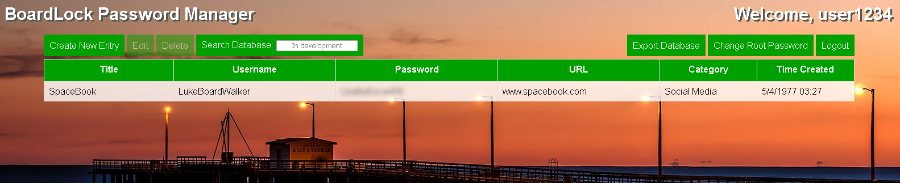

# BoardLock Online Password Manager
<a href="https://benkofman.com">https://benkofman.com</a>

## Introduction
About three weeks ago, I started making this website as a way to learn more about application security and web development and to improve my programming skills. Since I have just begun my final semester in college I will need to take a break from the project, but have gotten to a point where the application is usable.

### Intentions:
* Use existing skills to develop an application relating to securing sensitive information
* Gain new programming skills and learn how to prevent common web application attacks
* Implement zero-knowledge architecture and best practices for handling user data 

### Considerations:
The best password managers are often run locally in the OS or browser, such as KeyPassXC or LastPass. While using an offline password manager is the likely safest option, I wanted to make one online for the experience of learning how to protect against different vulnerabilities and write secure code.

### Results:
The application is online and fully functional, barring the search database feature. Additionally, the site uses fixed widths based on percentages so adjusting the browser window moves buttons around and it isn't optimized for mobile browsers. I might go back and fix these UI issues when I get the chance, but at this point, I believe I have accomplished the original goal by prioritizing security.

## Application Design:
### Server:
* Flask Python backend
* AWS Lightsail virtual server (very cheap) and DDOS/Origin IP address protection with Cloudflare reverse proxy
* Account data stored in AWS DynamoDB and user data files stored in S3

### Security Architecture:
* All root passwords randomly salted and hashed with bcrypt and stored as auth_key
* User data encryption key is encrypted with Key-Encryption-Key (KEK)
* KEK generated from root password and salt using PBKDF2
* User data encrypted with data encryption key

DynamoDB Database - all sensitive data (passwords, encryption keys) is encrypted/hashed/unknown to me.
If breached, bcrypt and random salts will make it very difficult for root passwords to be brute-forced.

All encryption/decryption occurs on the server, and no sensitive data remains in memory as it is all passed as function parameters and deleted after execution. Client-side decryption would decrease the server's compute load, but has issues of its own. The keys or password would need to be stored in localStorage to provide some usability which could expose the user to Cross-Site Scripting.

To bypass requiring the user to enter their root password for any change/request, the KEK must be stored in a Flask session cookie. 

Flask signed session cookie contains: username, authentication token, KEK
* Auth token renews each time the user logs in and is deleted on logout. Stored as SHA256 hash in DB for efficiency
* KEK used to decrypt data_key so changes to data can be saved and encrypted, and the user does not have to enter the root each time the page is refreshed

Cookie security:
* Signed to prevent forgery
* HttpOnly to prevent XSS
* Session hijacking is not enough to gain access or decrypt data, need the KEK and data_key and data (which requires access to both S3 and DynamoDB) to see passwords. Storing the KEK is not optimal but is necessary for increased usability and much, much better than storing the root password in the cookie.
* Attackers gaining the auth_token creates a security hole but is mitigated by the user logging out when they're done or closing the browser, which deletes the existing token (timed tokens are a future security update). It is common for PW managers running locally not to stay signed in as well.

Plaintext data is sent in transit:
* Automatic HTTPS upgrades
* HSTS enabled for boardlock subdomain to prevent SSL stripping
* Secure = True Flask session cookie to prevent a cookie from being sent over HTTP
* Hashing passwords in transit is vulnerable to Pass the Hash and provides little benefit
* Client-side localStorage is generally less secure than cookies

## Lessons Learned
* Understand the software before writing the code - used the Flask session cookie to store the root password without understanding session hijacking and falsely believing the cookie was encrypted, not signed.
* Test on production just as much as locally - different environments will render different results, especially when using various cloud infrastructures.
* The relationship between usability/convenience and security is not so clear. The application would be more secure if no data was stored as cookies on the user's browser, but in that case, they would need to enter their password for every change and every request. That would encourage users to choose insecure passwords that are easy to enter and thus crack. No networks or applications are impenetrable, and it's up to the developers to figure out the right balance of data protection and user experience.

# To-do
* Code comments
* Search Database
* Token expiration
* Input validation / fuzzing
* Password strength meter
* CSRF form tokens
* Mobile browser templates
* Fixed UI widths
* Browser extension to autofill passwords into other sites
* IP address request limiting
